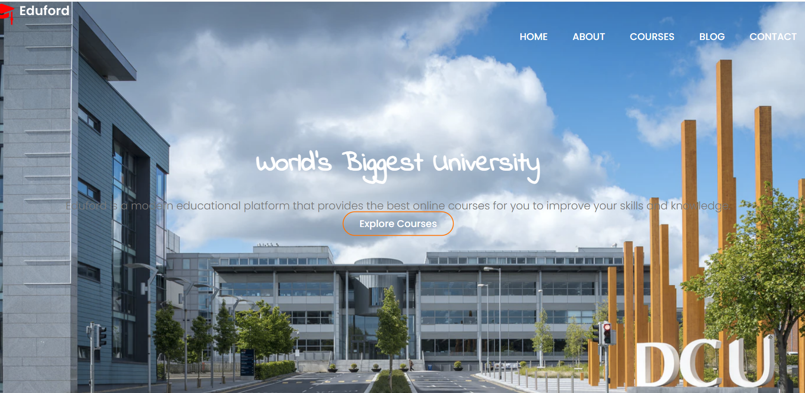
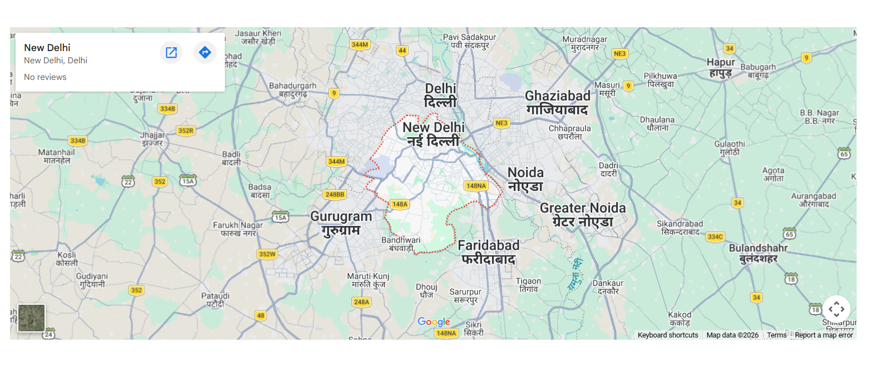
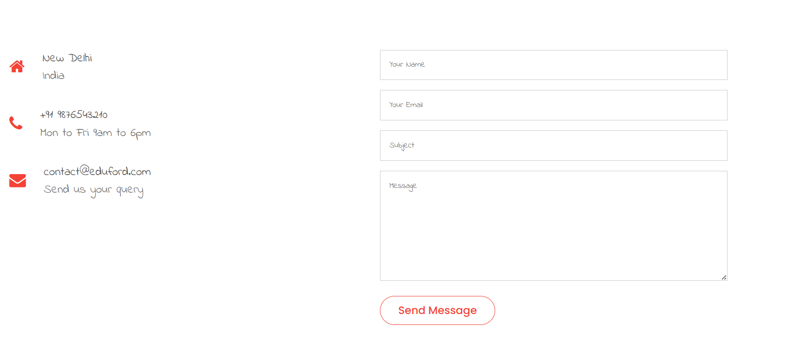
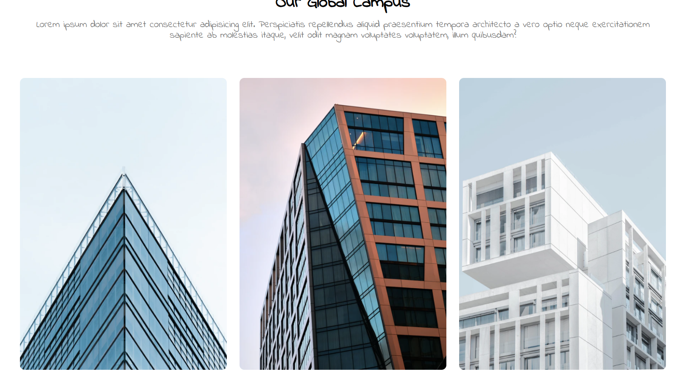
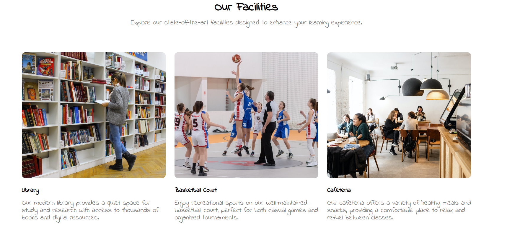

# 🎓 University Website

A responsive **University Website** built using **HTML, CSS, JavaScript, and PHP**.
This project demonstrates a modern university landing page design with multiple sections such as campus information, facilities, blog, courses, and a contact page with Google Maps integration.

---

## 🚀 Features

* Responsive website layout
* Multi-page navigation (Home, About, Courses, Blog, Contact)
* Campus and facilities showcase
* Contact form with PHP handler
* Embedded Google Maps location
* Clean and modern UI design

---

## 🛠️ Tech Stack

* **HTML5** – Website structure
* **CSS3** – Styling and layout
* **JavaScript** – Interactive functionality
* **PHP** – Contact form handling

---

## 📸 Website Screenshots

### 🏠 Home Page



### 🗺️ Map Location



### 📩 Contact Page



### 🏫 Campus Section



### 🏢 Facilities Section



---

## 📂 Project Structure

```
University-Website
│
├── index.html
├── about.html
├── blog.html
├── course.html
├── contact.html
├── style.css
├── form-handler.php
├── home.png
├── map.png
├── contact.png
├── campus.png
├── facility.png
└── eduford_img (images folder)
```

---

## ⚙️ How to Run the Project

1. Download or clone the repository
2. Open the project folder
3. Run `index.html` in your browser

Note: The contact form uses **PHP**, so it will only work on a local server (like XAMPP or Live Server with backend support).

---

## 👩‍💻 Author

**Priya**

Aspiring Software Developer passionate about **Data Structures & Algorithms (Java)** and **Web Development**.
